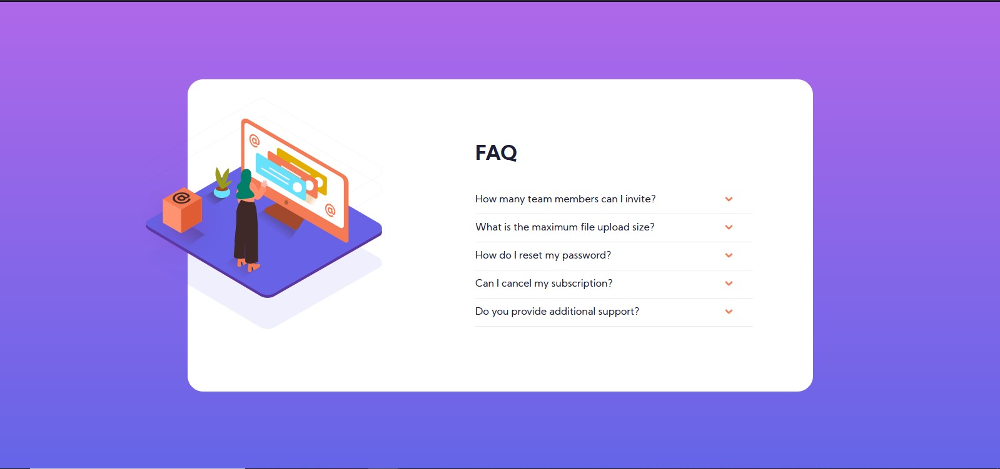

# Frontend Mentor - FAQ accordion card solution

This is a solution to the [FAQ accordion card challenge on Frontend Mentor](https://www.frontendmentor.io/challenges/faq-accordion-card-XlyjD0Oam). Frontend Mentor challenges help you improve your coding skills by building realistic projects.

## Table of contents

- [Overview](#overview)
  - [The challenge](#the-challenge)
  - [Screenshot](#screenshot)
  - [Links](#links)
- [My process](#my-process)
  - [Built with](#built-with)
  - [What I learned](#what-i-learned)
- [Author](#author)

## Overview

My solution for the challenge

### The challenge

Users should be able to:

- View the optimal layout for the component depending on their device's screen size
- See hover states for all interactive elements on the page
- Hide/Show the answer to a question when the question is clicked

### Screenshot

### Links

- Solution URL: [Github Repository](https://github.com/haronacosta/faq-accordion-card)
- Live Site URL: [Github Pages](https://haronacosta.github.io/faq-accordion-card/)

## My process

A new developer, learning React

### Built with

- Semantic HTML5 markup
- CSS custom properties
- Flexbox
- [React](https://reactjs.org/) - JS library
- [Sass](https://sass-lang.com/) - For styles

### What I learned

I learned the useState fundamentals

## Author

Haron Acosta

- Frontend Mentor - [@haronacosta](https://www.frontendmentor.io/profile/haronacosta)
- Twitter - [@haronacostav](https://www.twitter.com/haronacostav)
